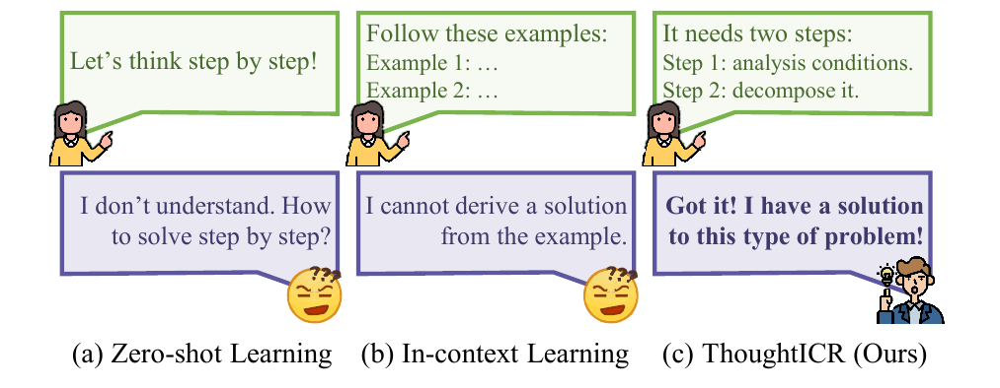
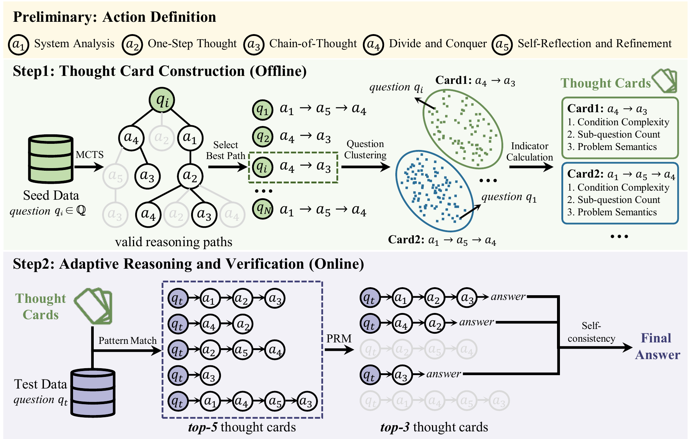

<h1 align="center">
<br>
ThoughtICR
</h1>

<p align="center">
📚 <a href="https://aclanthology.org/2026.acl-long.135/" target="_blank">[ACL 2026]</a> &nbsp;&nbsp;&nbsp;🤗 <a href="https://huggingface.co/papers/2411.18478" target="_blank">[Daily Paper]</a> &nbsp;&nbsp;&nbsp;💻 <a href="https://github.com/jinyangwu/ThoughtICR" target="_blank">[Code]</a>
</p>

This repository is the official implementation of **[Beyond Examples: Towards Automated Thought-level In-Context Reasoning for Large Language Models](https://aclanthology.org/2026.acl-long.135/)**, accepted to **ACL 2026 Long Papers**.

If you have any questions ❓ or are interested in collaboration 🤝, please feel free to contact me at
wu-jy23@mails.tsinghua.edu.cn.

## News

- **ACL 2026**: ThoughtICR was accepted to the 64th Annual Meeting of the Association for Computational Linguistics (Long Papers).

## Contents

- [Introduction](#introduction)
- [Requirements](#requirements)
- [Usage](#usage)
- [Acknowledgement](#acknowledgement)
- [Citation](#citation)

## Introduction

We introduce **ThoughtICR**, an automated **Thought**-level **I**n-**C**ontext **R**easoning paradigm for large language models. ThoughtICR rethinks the role of context in in-context learning: instead of asking models to imitate surface-level examples, it provides explicit, reusable, and guidance-oriented thought patterns for complex reasoning.

<p align="center">
  
    <br>
    <em>Figure 1: Solution comparison. Zero-shot learning relies on generic instructions, in-context learning depends on carefully selected demonstrations, and ThoughtICR provides high-level reasoning patterns for robust problem solving.</em>
</p>

ThoughtICR first defines five atomic reasoning actions: **System Analysis (SA)**, **One-Step Thought (OST)**, **Chain-of-Thought (CoT)**, **Divide and Conquer (DC)**, and **Self-Reflection and Refinement (SRR)**. Based on these actions, it uses Monte Carlo Tree Search (MCTS) on small-scale seed data to automatically derive high-level thought patterns and encapsulate them as structured thought cards. During inference, ThoughtICR dynamically selects appropriate thought cards according to target problem attributes, guiding the model through adaptive reasoning and verification.

Specifically, **ThoughtICR** consists of two main components:

- *Thought Card Construction (Offline)*: Leverage MCTS to automatically construct high-level thought cards from seed data, providing explicit guidance for subsequent inference.
- *Adaptive Reasoning and Verification (Online)*: Dynamically select optimal thought cards by problem attributes, guide model reasoning with the selected patterns, and verify candidate solutions.

The overall framework is shown below:

<p align="center">
  
    <br>
    <em>Figure 2: Flowchart of ThoughtICR. The framework consists of two main parts: (1) Thought Card Construction (Offline); and (2) Adaptive Reasoning and Verification (Online).</em>
</p>

Extensive experiments across **nine benchmarks** and **seven reasoning domains** show that ThoughtICR improves performance across different model sizes and generalizes effectively from mathematical reasoning to agentic reasoning. With only small-scale seed data, ThoughtICR achieves **80.6%** accuracy on MATH and **62.5%** on AMC, surpassing GPT-4o's **77.2%** and **57.5%**, respectively. Compared with leading test-time scaling methods, ThoughtICR also reduces computational cost by over **10x**.

## Requirements

We recommend using conda for environment management and executing the code on an A100 80G GPU equipped with CUDA 12.4.

1. Create a Python environment with python 3.10:

```
conda create -n thoughticr python==3.10
conda activate thoughticr
```

2. Install requirements

```
pip install --upgrade pip
pip install -r requirements.txt
```

## Usage

> ThoughtICR consists of two steps, and our released code implements an efficient parallel tree search. To ensure fair comparison with methods such as rStar, the time cost reported in our paper corresponds to the non-parallelized version, following the same measurement protocol adopted in previous works. In practical applications, however, the parallel implementation provided in this repository can lead to substantially improved efficiency.

### Step 1: Construct high-level thought cards via MCTS

Using a small seed dataset, ThoughtICR derives reasoning paths (Phase 1) and distills them into thought cards (Phase 2). These cards serve as prior reasoning guidance for the testing stage, enabling efficient adaptive reasoning.

#### *Phase 1: Acquire reasoning paths for seed data*

You may choose to use the following command to acquire reasoning paths for each question in the seed dataset, guided by MCTS. Before running it, prepare a seed dataset by randomly sampling from a single dataset or by combining multiple datasets, such as in a multi-task system.

```bash
bash scripts/generate_paths.sh
```

The script `generate_paths.sh` includes several configurable parameters:

- `--dataset_name`: Name of the dataset (e.g. MATH).
- `--test_json_filename`: Filename for the seed data (default: train_all).
- `--model_ckpt`: Path to the model checkpoint (e.g. meta-llama/Meta-Llama-3-8B-Instruct).
- `--num_rollouts`: Number of rollouts (default: 8).

> ⚠️ Make sure to adjust these parameters according to your requirements. If the vLLM server fails to start, you can remove `nohup` and run it in the foreground for debugging. Based on our experimental experience, the most likely causes are port errors or incorrect `MODEL_NAME` paths. Moreover, if the vLLM server starts successfully but you encounter connection errors when running the generate file, the port in `models/OpenAI_API.py` might not match the port used when starting vLLM.

#### *Phase 2: Distill paths into thought cards*

After executing MCTS, we obtain a tree structure for each seed dataset question, yielding multiple valid reasoning paths. Subsequently, we distill thought cards based on the proposed metrics, including subquestion count, problem condition complexity, and semantic similarity.

```bash
CUDA_VISIBLE_DEVICES="0" python distill.py
```

### Step 2: Adaptive Reasoning Pattern Selection

Note that in the previous step implemented in ```distill.py```, we have pre-matched the optimal five cards for each question in the test set. Therefore, during the testing phase, these pre-matched cards can be directly utilized. Alternatively, metric calculation and card matching can also be performed during the MCTS testing phase.

#### *Reasoning*

Using selected thought cards as templates, ThoughtICR maintains the benefits of tree-structured reasoning without extensive node expansion. By following the specified action sequences on thought cards (e.g., SA → OST → CoT), the LLM decomposes the reasoning process into a series of sequential steps, generating multiple valid candidate solutions for the test question. Each step corresponds to a distinct atomic action, ensuring structured and systematic reasoning throughout inference.

```bash
bash scripts/generate_test.sh
```

The script `generate_test.sh` includes several configurable parameters:

- `--dataset_name`: Name of the dataset (e.g. MATH).
- `--test_json_filename`: Filename for the seed data (default: test_all).
- `--model_ckpt`: Path to the model checkpoint.
- `--attribute_type`: Type of cognitive complexity (e.g. condition).

> ⚠️ Make sure to adjust these parameters according to your requirements.

#### *Verification*

Identifying the most accurate reasoning trajectory among multiple candidate solutions represents a critical challenge. We investigate three verification methods: process supervision, outcome supervision, and self-consistency. We use process supervision with self-consistency verification by default.

```bash
CUDA_VISIBLE_DEVICES="0" python verification.py --type consistency --score_type product --k 0.95
```

You can adjust the corresponding verification methods according to your requirements.

## Acknowledgement

- [rStar](https://github.com/zhentingqi/rStar): We start our codebase from rStar.
- [RLHFlow-PRM-Mistral-8B](https://huggingface.co/RLHFlow/Llama3.1-8B-PRM-Mistral-Data): We utilize this process reward model by default.
- [vLLM](https://github.com/vllm-project/vllm): We adopt this fantastic framework.

## Citation

If you find this repo useful for your research, please consider citing our paper:

```bibtex
@inproceedings{wu-etal-2026-beyond-examples,
    title = "Beyond Examples: Towards Automated Thought-level In-Context Reasoning for Large Language Models",
    author = "Wu, Jinyang  and
      Feng, Mingkuan  and
      Zhang, Shuai  and
      Che, Feihu  and
      Wen, Zhengqi  and
      Liao, Chonghua  and
      Yang, Ling  and
      Luo, Haoran  and
      Lian, Zheng  and
      Tao, Jianhua",
    editor = "Liakata, Maria  and
      Moreira, Viviane P.  and
      Zhang, Jiajun  and
      Jurgens, David",
    booktitle = "Proceedings of the 64th Annual Meeting of the Association for Computational Linguistics (Volume 1: Long Papers)",
    month = jul,
    year = "2026",
    address = "San Diego, California, United States",
    publisher = "Association for Computational Linguistics",
    url = "https://aclanthology.org/2026.acl-long.135/",
    pages = "2955--2995",
    ISBN = "979-8-89176-390-6"
}
```

Your support by starring ⭐ this repository would be greatly appreciated!
